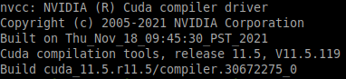

<a name="readme-top"></a>

[![Contributors][contributors-shield]][contributors-url]
[![Forks][forks-shield]][forks-url]
[![Stargazers][stars-shield]][stars-url]
[![Issues][issues-shield]][issues-url]
[![GPL-3.0 License][license-shield]][license-url]


<!-- PROJECT LOGO -->
<br />
<div align="center">
  <a href="https://github.com/cargonvis/docker-mask-rcnn-pytorch">
    
  </a>

<h3 align="center">DOCKER-MASK-RCNN-PYTORCH</h3>

  <p align="center">
    Dockerized Mask-RCNN model with Pytorch and annotation toolkit for user-friendly training from scratch.
    <br />
    <a href="https://github.com/cargonvis/docker-mask-rcnn-pytorch"><strong>Explore the docs »</strong></a>
    <br />
    <br />
    <a href="https://github.com/cargonvis/docker-mask-rcnn-pytorch">View Demo</a>
    ·
    <a href="https://github.com/cargonvis/docker-mask-rcnn-pytorch/issues">Report Bug</a>
    ·
    <a href="https://github.com/cargonvis/docker-mask-rcnn-pytorch/issues">Request Feature</a>
  </p>
</div>


<!-- TABLE OF CONTENTS -->
<details>
  <summary>Table of Contents</summary>
  <ol>
    <li>
      <a href="#about-the-project">About The Project</a>
      <ul>
        <li><a href="#built-with">Built With</a></li>
      </ul>
    </li>
    <li>
      <a href="#getting-started">Getting Started</a>
      <ul>
        <li><a href="#prerequisites">Prerequisites</a></li>
        <li><a href="#installation">Installation</a></li>
      </ul>
    </li>
    <li><a href="#usage">Usage</a></li>
    <!-- <li><a href="#roadmap">Roadmap</a></li> -->
    <li><a href="#future-improvements">Future Improvements</a></li>
    <li><a href="#contributing">Contributing</a></li>
    <li><a href="#license">License</a></li>
    <li><a href="#contact">Contact</a></li>
    <li><a href="#acknowledgments">Acknowledgments</a></li>
  </ol>
</details>


<!-- ABOUT THE PROJECT -->
## About The Project

<!-- [![Product Name Screen Shot][product-screenshot]](https://example.com) --> 
![Product Name Screen Shot][product-screenshot] <!-- Image without link -->

The Automatized Mask-RCNN-pytorch project simplifies the process of training and deploying a segmentation object detection model (both instance and semantic segmentation) by providing a streamlined workflow, GPU support, and data augmentation techniques. It empowers users to achieve accurate and efficient object detection for various applications.

<p align="right">(<a href="#readme-top">back to top</a>)</p>


### Built With

* [![Docker][Docker.org]][Docker-url]
* [![Python][Python.org]][Python-url]
* [![Pytorch][Pytorch.org]][Pytorch-url]
* [![OpenCV][OpenCV.org]][OpenCV-url]
* [![Bash][Bash.org]][Bash-url]

<p align="right">(<a href="#readme-top">back to top</a>)</p>


<!-- GETTING STARTED -->
## Getting Started

To get started with this project, make sure your device has a GPU. Follow the steps below:

### Prerequisites

If you don't have Docker installed, follow the instructions [here](https://www.digitalocean.com/community/tutorials/how-to-install-and-use-docker-on-ubuntu-22-04)

### Installation

1. Clone the repo:
   ```
   git clone https://github.com/cargonvis/docker-mask-rcnn-pytorch.git
   ```

2. Check if your computer has NVIDIA drivers installed by running the command nvidia-smi. If you see an output like the attached image, you already have the drivers. 
   
   

   Otherwise, install the NVIDIA drivers compatible to your GPU using the following command:
   ```
   sudo apt install nvidia-driver-535 nvidia-dkms-535
   ```

3. Check if your computer has a CUDA (compatible to the NVIDIA drivers) installed by running the command nvcc --version. If you see an output like the attached image, you already have the drivers.

   

   Otherwise, install CUDA drivers compatible to your GPU using the following command:
   ```
   sudo apt install nvidia-cuda-toolkit
   ```

4. Restart your device to apply the driver changes.

5. Install the NVIDIA Container Toolkit by running the following commands:
   ```
   sudo rm /etc/apt/sources.list.d/nvidia-container-toolkit.list
   wget https://developer.download.nvidia.com/compute/cuda/repos/ubuntu2004/x86_64/cuda-keyring_1.0-1_all.deb
   sudo dpkg -i cuda-keyring_1.0-1_all.deb
   sudo apt-get update
   sudo apt-get -y install nvidia-container-toolkit
   systemctl restart docker
   ```

<p align="right">(<a href="#readme-top">back to top</a>)</p>


<!-- USAGE EXAMPLES -->
## Usage

1. Access the project folder:
   ```
   cd docker-mask-rcnn-pytorch
   ```

2. Before building the Docker image, make sure to move your images to the "images" folder:

3. Build the Docker image:
   ```
   docker build -t docker-mask-rcnn-pytorch_image .
   ```
   If any error during building the image (specially if the Dockerfile is modified after being built), build the image from zero using the following command:
   ```
   docker build --no-cache -t docker-mask-rcnn-pytorch_image .
   ```

4. Once the image is built, run the container with access to your GPU and USB0 (if you have a USB webcam):
   ```
   docker run --gpus all -e DISPLAY=$DISPLAY -it -p 8888:8888 --privileged -v /tmp/.X11-unix/:/tmp/.X11-unix/ -v /dev/bus/video0:/dev/bus/video0 --network="host" --ipc=host --name docker-mask-rcnn-pytorch_webcam_GPU docker-mask-rcnn-pytorch_image
   ```
   For future runs, start the container using the following command:
   ```
   docker start -ai docker-mask-rcnn-pytorch_webcam_GPU
   ```
   If any error when running or starting the container, run the following command and then try to run or start the container again:
   ```
   xhost + local:docker
   ```

5. If you need to apply data augmentation, run the following command inside the container:
   ```
   python3 data_augmentation.py
   ```
   By default, the script applies seven different data augmentation techniques. You can customize this by modifying the code and commenting out the techniques you don't want to apply.

<!-- 6. Before annotating, create a "classes.txt" file in the image folder to list the classes to annotate. Ensure that the class names are in singular form, lowercase, and without any special characters or spaces. Each class should be on a separate line.

    -->

7. To annotate your images, run the annotation tool:
   ```
   labelme
   ```
   

   Simply click in "Create Polygons" and you can start the annotations. After each polygon, add the name of the object and do not forget to click on "Save" before continuing with the next image.
   
   After annotating the images, you should have a folder with the annotated images and the corresponding annotation files (json files).

8. Prepare the data for training, including moving images to the corresponding folder, creating labels.txt file, exporting VOC-format dataset from json files, etc., by running the following command:
   ```
   ./preparation_for_training
   ```

9. Navigate to the Mask-RCNN-pytorch folder and train your model using the command displayed in the screen:
   ```
   python3 train.py --data my_dataset --num_classes 12 --num_epochs 100
   ```
   Modify the number of classes and epochs if needed. You can adjust batch size using: --batchsize <batch_size>. If you encounter device memory issues during training, consider decreasing the batch size (by default is 4).

<!-- 11. Check the evaluation metrics and other training aspects in the runs/train/yolov7-custom/ directory. Use image viewing tools like fim to visualize the metrics. Example: fim confusion_matrix.png. -->

10. Make predictions on test image or video by running the following command:
    ```
    python3 test.py --input test_img_or_video.jpg --model ./maskrcnn_saved_models/mask_rcnn_model.pt
    ```
    Again, replace test_img_or_video.jpg with your chosen image (or video) for testing. Also replace mask_rcnn_model.pt with the epoch file that you consider as your best model. <!-- You can adjust the prediction threshold using: --threshold <threshold> (by default is 0.5). -->
    For image prediction, image will be automatically displayed. It can also be visualized by going to the "results" directory and use a tool like "fim" for viewing. Example: fim mytestimage.jpg. 
    For video prediction, it will not be displayed automatically. It can be visualized by going to the "results" directory and use a tool like "mplayer" for playing the video. Example: mplayer mytestvideo.mp4.
    
<!-- _For more examples, please refer to the [YOLOv7 Documentation](https://github.com/WongKinYiu/yolov7)_ -->

<p align="right">(<a href="#readme-top">back to top</a>)</p>


<!-- ROADMAP -->
<!--## Roadmap

- [ ] Feature 1
- [ ] Feature 2
- [ ] Feature 3
    - [ ] Nested Feature-->

See the [open issues](https://github.com/cargonvis/docker-mask-rcnn-pytorch/issues) for a full list of proposed features (and known issues).

<p align="right">(<a href="#readme-top">back to top</a>)</p>


<!-- FUTURE IMPROVEMENTS -->
## Future Improvements

- Test the model with videos or in real-time webcam.
- Investigate and implement 3D annotations specifically for videos, enabling more advanced object analysis, tracking, and understanding in three-dimensional space.

<p align="right">(<a href="#readme-top">back to top</a>)</p>


<!-- CONTRIBUTING -->
## Contributing

Contributions are what make the open source community such an amazing place to learn, inspire, and create. Any contributions you make are **greatly appreciated**.

If you have a suggestion that would make this better, please fork the repo and create a pull request. You can also simply open an issue with the tag "enhancement".
Don't forget to give the project a star! Thanks again!

1. Fork the Project
2. Create your Feature Branch (`git checkout -b feature/AmazingFeature`)
3. Commit your Changes (`git commit -m 'Add some AmazingFeature'`)
4. Push to the Branch (`git push origin feature/AmazingFeature`)
5. Open a Pull Request

<p align="right">(<a href="#readme-top">back to top</a>)</p>


<!-- LICENSE -->
## License

Distributed under the GNU General Public License v3.0. See `LICENSE` for more information.

<p align="right">(<a href="#readme-top">back to top</a>)</p>


<!-- CONTACT -->
## Contact

[![Email][Email-shield]][Email-url] [![LinkedIn][linkedin-shield]][linkedin-url] [![Discord][Discord-shield]][Discord-url]

Project Link: [https://github.com/cargonvis/docker-yolov7](https://github.com/cargonvis/docker-mask-rcnn-pytorch)

<p align="right">(<a href="#readme-top">back to top</a>)</p>


<!-- ACKNOWLEDGMENTS -->
## Acknowledgments

This project extends its gratitude to the following resources for their valuable contributions:

* [Mask_RCNN Github repository](https://github.com/matterport/Mask_RCNN)
* [Mask-RCNN-pytorch Github repository](https://github.com/4-geeks/Mask-RCNN-pytorch)
* [labelme Github repository](https://github.com/wkentaro/labelme)

<p align="right">(<a href="#readme-top">back to top</a>)</p>


<!-- MARKDOWN LINKS & IMAGES -->
<!-- https://www.markdownguide.org/basic-syntax/#reference-style-links -->
[contributors-shield]: https://img.shields.io/github/contributors/cargonvis/docker-mask-rcnn-pytorch.svg?style=for-the-badge
[contributors-url]: https://github.com/cargonvis/docker-mask-rcnn-pytorch/graphs/contributors
[forks-shield]: https://img.shields.io/github/forks/cargonvis/docker-mask-rcnn-pytorch.svg?style=for-the-badge
[forks-url]: https://github.com/cargonvis/docker-mask-rcnn-pytorch/network/members
[stars-shield]: https://img.shields.io/github/stars/cargonvis/docker-mask-rcnn-pytorch.svg?style=for-the-badge
[stars-url]: https://github.com/cargonvis/docker-mask-rcnn-pytorch/stargazers
[issues-shield]: https://img.shields.io/github/issues/cargonvis/docker-mask-rcnn-pytorch.svg?style=for-the-badge
[issues-url]: https://github.com/cargonvis/docker-mask-rcnn-pytorch/issues
[license-shield]: https://img.shields.io/github/license/cargonvis/docker-mask-rcnn-pytorch.svg?style=for-the-badge
[license-url]: https://github.com/cargonvis/docker-mask-rcnn-pytorch/blob/master/LICENSE
[product-screenshot]: project_images/project_image.png
[Docker.org]: https://img.shields.io/badge/Docker-blue.svg?logo=docker&style=for-the-badge&logoColor=white
[Docker-url]: https://www.docker.com/
[Python.org]: https://img.shields.io/badge/Python-3776AB?logo=python&style=for-the-badge&logoColor=fff
[Python-url]: https://www.python.org/
[Pytorch.org]: https://img.shields.io/badge/Pytorch-red?logo=Pytorch&style=for-the-badge&logoColor=white
[Pytorch-url]: https://pytorch.org/
[OpenCV.org]: https://img.shields.io/badge/OpenCV-LIME?logo=Opencv&style=for-the-badge&logoColor=white%22
[OpenCV-url]: https://opencv.org/
[Bash.org]: https://img.shields.io/badge/GNU%20Bash-4EAA25?logo=gnubash&style=for-the-badge&logoColor=fff
[Bash-url]: https://www.gnu.org/software/bash/
[Email-shield]: https://img.shields.io/badge/gmail-red?style=for-the-badge&logo=gmail&logoColor=white
[Email-url]: mailto:cgonv1993@gmail.com
[linkedin-shield]: https://img.shields.io/badge/linkedin-blue?style=for-the-badge&logo=linkedin&logoColor=white
[linkedin-url]: https://linkedin.com/in/carlosgonzalezvisiedo
[Discord-shield]: https://img.shields.io/badge/discord-darkblue?style=for-the-badge&logo=discord&logoColor=white
[Discord-url]: https://discordapp.com/users/439897699299491850